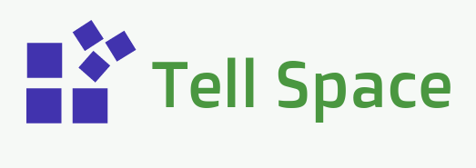

 <link rel="shortcut icon" type="image/png" href="Tell-Space-Logo-2.png">

# Welcome To Tell Space Feedback
## <a href="http://tellspace.ml"> Back To Main Website </a>
 
# Please take our feedback survey
## And tell us what you think about our projects, labs and website.
<a href="https://docs.google.com/forms/d/e/1FAIpQLSculaUDt0evsAZmzSyHNx7Ffr5qDOqf4w13YSlBdXZp-SrhRg/viewform?usp=sf_link"> If you want to take the survey on a full website klick on this link </a>
<iframe src="https://docs.google.com/forms/d/e/1FAIpQLSculaUDt0evsAZmzSyHNx7Ffr5qDOqf4w13YSlBdXZp-SrhRg/viewform?embedded=true" width="750" height="800" frameborder="0" marginheight="0" marginwidth="0">Loading...</iframe>
 
 
 

# Contact & Support
## Contact
E-Mail: contact@tellspacehq.ml
 
 
Instagram: @tellspace
 
 
Hashtags: #tellspace, #onyxbash, #opusapp.
 
 
Github: <a href="https://github.com/TellSpaceOfficial"> TellSpaceOfficial </a>
 
 
 
## Support
### Having problems with our projects or labs?
### Comment on github, instagram or e-mail us:
 
E-Mail: info@tellspacehq.ml
 
 
Instagram: @tellspace
 
 
Github: <a href="https://github.com/TellSpaceOfficial"> TellSpaceOfficial </a>
 
 
 
 
 
 
### Tell Space 2017. <a href="https://github.com/TellSpaceOfficial"> Github </a>
 

